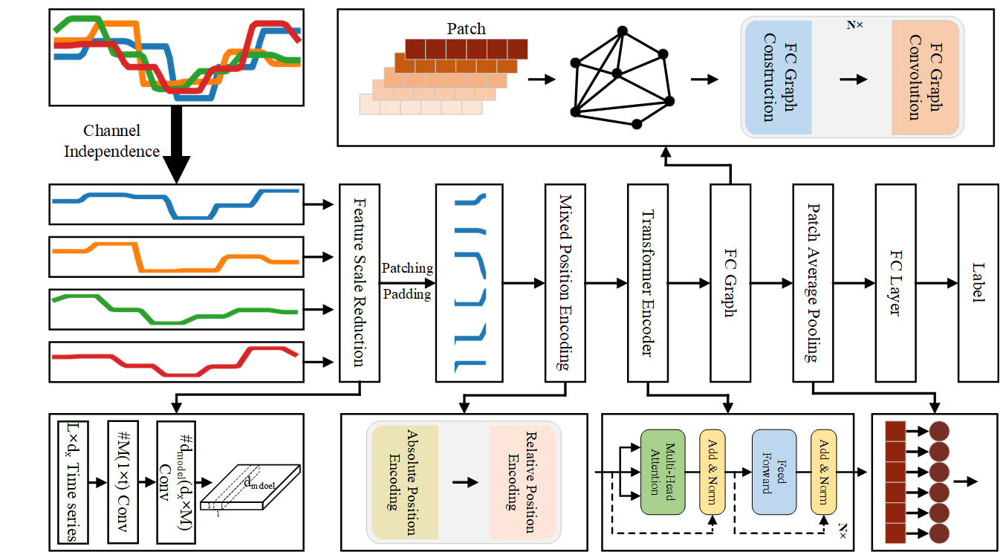

## This project is the source code for PatchMTSC.

    

    

## Datasets
We evaluated the ConvTran model using a combination of 30 datasets from the UEA archive. 
You can manually download the datasets using the provided link and place them into the pre-made directory.

UEA: http://www.timeseriesclassification.com/Downloads/Archives/Multivariate2018_ts.zip

Copy the datasets folder to: Datasets/UEA/

## Credits

Some parts of the Code are taken from [ConvTran](https://github.com/Navidfoumani/ConvTran).
